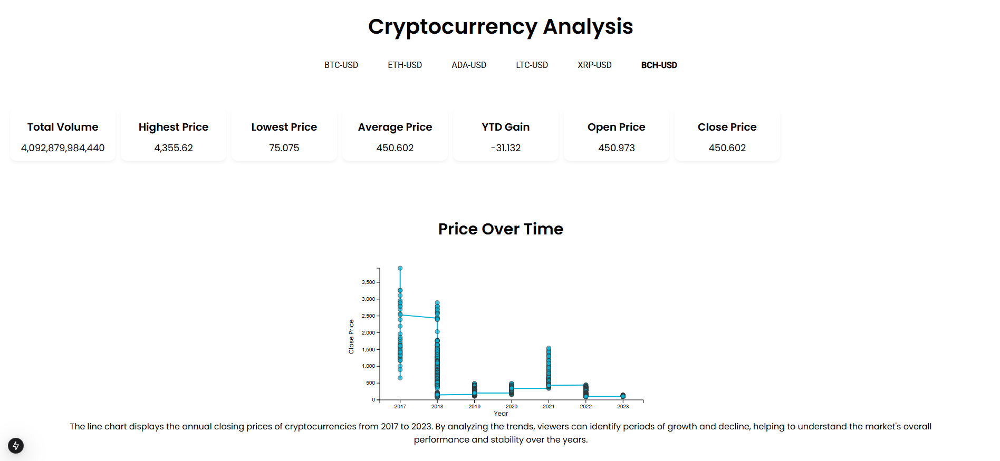

# Cryptocurrency Analysis Dashboard

A modern, interactive dashboard for exploring cryptocurrency market data. Switch between assets, inspect price and volume trends, review key metrics, and visualize correlation and risk–reward profiles—all from CSV files served locally.

**Live demo:** [crypto-analysiss.vercel.app](https://crypto-analysiss.vercel.app)  
**Repository:** [github.com/abeeraisabeera/Crypto_Analysiss](https://github.com/abeeraisabeera/Crypto_Analysiss)

<p align="center">
  
</p>

## Features

- **Sticky top bar** — Asset tabs (BTC, ETH, ADA, LTC, XRP, BCH), dark/light theme toggle, last-updated timestamp
- **Hero summary** — Live price with count-up animation, 24h change badge, 30-session sparkline
- **Metrics grid** — Total volume, highest/lowest price, YTD gain with contextual badges and trend hints
- **Main chart** — Combined price area + volume bars, time ranges (1M / 3M / 6M / 1Y / ALL), crosshair tooltip, zoom and pan
- **Correlation heatmap** — High vs. low price density with Pearson coefficient
- **Risk–reward chart** — Volatility vs. return bubbles sized by volume, quadrant labels, safety percentile vs. other assets
- **Responsive layout** — Mobile-friendly stacking, scrollable asset tabs, skeleton loading states
- **Accessibility** — Keyboard focus rings, chart `aria-label`s, semantic contrast in light and dark modes

## Tech Stack

| Layer | Tools |
|-------|--------|
| Framework | [Next.js 15](https://nextjs.org/) (App Router, React 19) |
| Styling | Tailwind CSS 3, CSS custom properties (light/dark themes) |
| Charts | [D3.js 7](https://d3js.org/) |
| Data | [Papa Parse](https://www.papaparse.com/) (CSV parsing) |
| Icons | [Lucide React](https://lucide.dev/) |
| Font | [Geist](https://vercel.com/font) |

## Getting Started

### Prerequisites

- [Node.js](https://nodejs.org/) 18+
- [pnpm](https://pnpm.io/) (recommended)

### Install & run

```bash
pnpm install
pnpm dev
```

Open [http://localhost:3000](http://localhost:3000).

### Other scripts

```bash
pnpm build    # Production build
pnpm start    # Serve production build
pnpm lint     # Run ESLint
```

## Data

CSV files live in `public/data/` and are loaded at runtime:

| File | Asset |
|------|--------|
| `BTC-USD.csv` | Bitcoin |
| `ETH-USD.csv` | Ethereum |
| `ADA-USD.csv` | Cardano |
| `LTC-USD.csv` | Litecoin |
| `XRP-USD.csv` | Ripple |
| `BCH-USD.csv` | Bitcoin Cash |

### CSV columns

| Column | Description |
|--------|-------------|
| `Open` | Opening price |
| `High` | High price |
| `Low` | Low price |
| `Close` | Closing price |
| `Volume` | Trading volume |
| `Year` | Calendar year |
| `YTD Gain` | Year-to-date gain (%) |

There is no `Date` column in the source files. The app assigns a synthetic daily date sequence starting **2014-01-01** so time-series charts and range filters work correctly. To use real dates, add a `Date` column to your CSVs and extend `normalizeRows` in `src/utils/dataLoader.js`.

## Project Structure

```text
crypto_analysis/
├── public/data/           # CSV datasets
├── src/
│   ├── app/               # Next.js layout, page, global styles
│   ├── components/dashboard/
│   │   ├── TopBar.js
│   │   ├── HeroSection.js
│   │   ├── MetricsGrid.js
│   │   ├── MainChart.js
│   │   ├── CorrelationHeatmap.js
│   │   ├── RiskRewardChart.js
│   │   └── ...
│   ├── hooks/             # Theme, count-up animation
│   └── utils/             # CSV loading, metrics, formatting
├── assets/                # Screenshots for docs
└── package.json
```

## How It Works

```text
CSV (public/data) → Papa Parse → normalizeRows → React state
                                      ↓
                    metrics (KPIs, correlation, risk stats)
                                      ↓
                    D3 charts + dashboard UI components
```

1. On load, all six asset CSVs are fetched and normalized.
2. Selecting an asset updates hero stats, metric cards, and charts with a short crossfade.
3. D3 renders the main price/volume chart, heatmap, and bubble chart inside client components.
4. Theme preference is stored in `localStorage` and applied via the `dark` class on `<html>`.

## Customization

- **Assets** — Edit `ASSETS` in `src/utils/dataLoader.js` and add matching `*-USD.csv` files under `public/data/`.
- **Colors** — Adjust CSS variables in `src/app/globals.css` (`--accent`, `--positive`, etc.).
- **Time ranges** — Default chart range and pills are configured in `src/components/dashboard/MainChart.js`.

## Deployment (Vercel)

The app is configured for [Vercel](https://vercel.com/) with `pnpm` via `vercel.json`.

```bash
pnpm install
npx vercel --prod
```

To enable automatic deploys on every push, connect the GitHub repo in the [Vercel project settings](https://vercel.com/abeeraisabeera-7226s-projects/crypto-analysiss/settings/git).

## License

[MIT](LICENSE) — Copyright (c) 2026 Abeera
